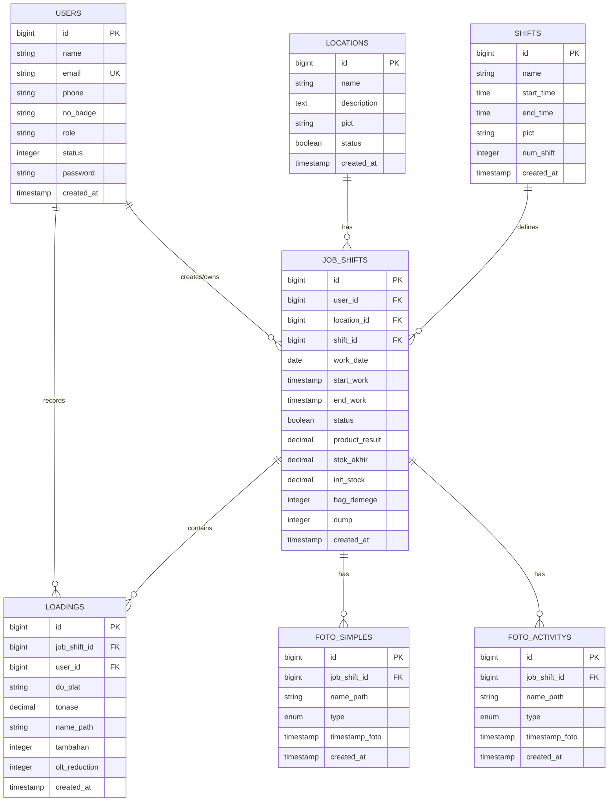
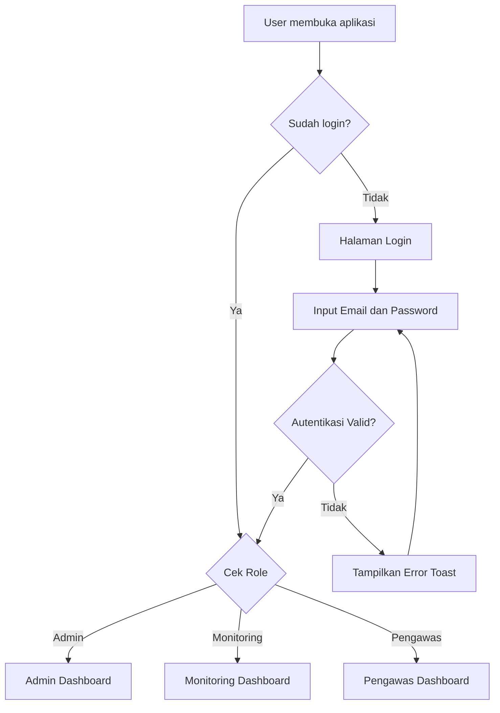
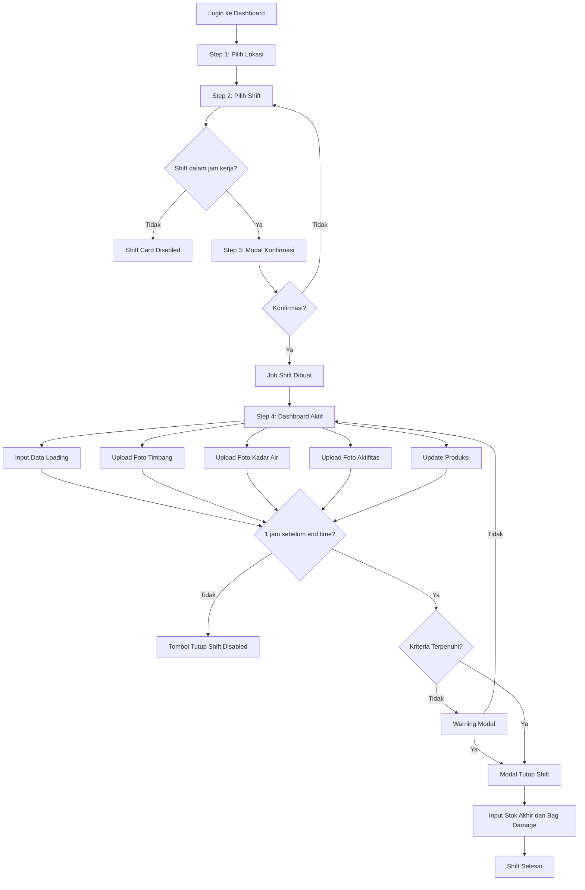
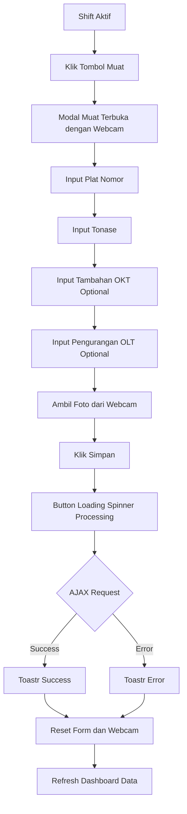
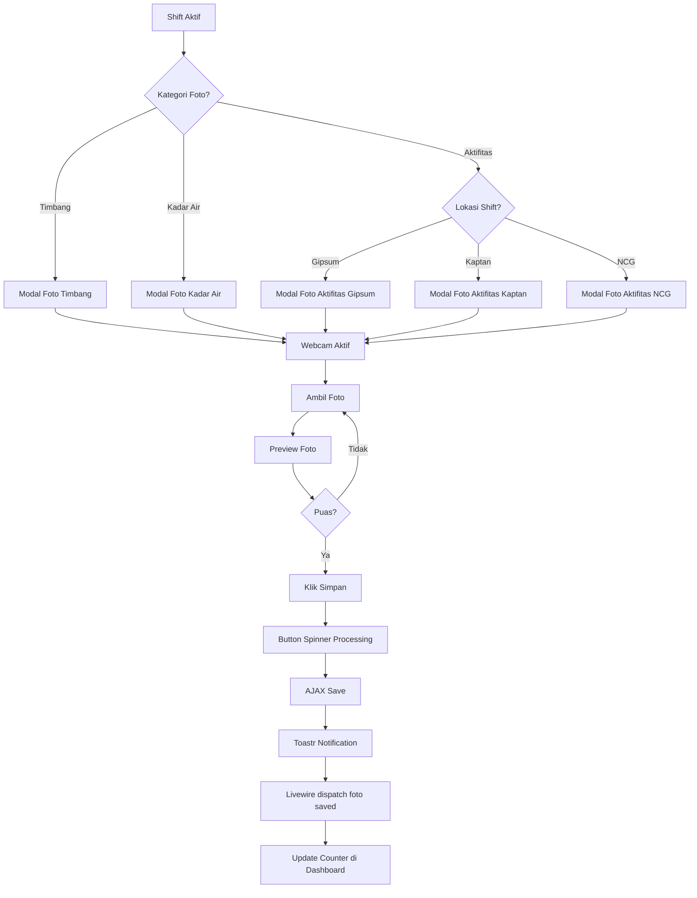
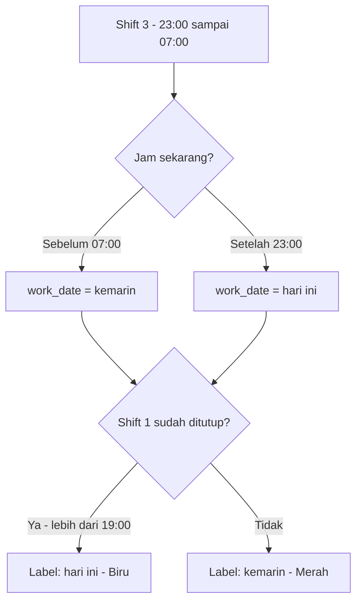

# GSG-Reporting Technical Documentation

**Versi Dokumen:** 2.0  
**Terakhir Diperbarui:** 12 Desember 2025

---

## Daftar Isi

1. [Pendahuluan](#1-pendahuluan)
2. [Teknologi yang Digunakan](#2-teknologi-yang-digunakan)
3. [Fitur-Fitur Aplikasi](#3-fitur-fitur-aplikasi)
4. [Arsitektur Aplikasi](#4-arsitektur-aplikasi)
5. [Database Schema](#5-database-schema)
6. [Alur Kerja Aplikasi](#6-alur-kerja-aplikasi)
7. [Panduan Pengguna (User Guide)](#7-panduan-pengguna-user-guide)
8. [API Routes](#8-api-routes)
9. [Instalasi dan Konfigurasi](#9-instalasi-dan-konfigurasi)
10. [Changelog](#10-changelog)

---

## 1. Pendahuluan

**GSG-Reporting** adalah sistem pelaporan berbasis web yang dirancang untuk mengelola dan memantau aktivitas kerja shift, pencatatan loading (pengangkutan), serta dokumentasi foto pada operasional pengantongan pupuk. Aplikasi ini membantu pengawas, admin, dan tim monitoring untuk melakukan pelaporan harian secara real-time.

### Tujuan Aplikasi

-   Mengelola jadwal shift kerja per lokasi (Gipsum, Kaptan, NCG)
-   Mencatat data loading (tonase pengangkutan) dengan foto bukti
-   Mendokumentasikan aktivitas melalui foto (timbang, kadar air, aktifitas produksi)
-   Tracking stok awal, stok akhir, bag damage, dan dump
-   Memberikan laporan real-time dan histori jadwal kerja
-   Mengelola data master (lokasi, shift, pengguna)

### Lokasi Produksi yang Didukung

| Lokasi   | Kode     | Deskripsi                              |
| ------   | ------   | -------------------------------------- |
| Kaptan   | kaptan   | Area produksi Kaptan                   |
| Petrocas | petrocas | Area produksi Petrocas                 |
| NCG      | ncg      | Area produksi NCG (Non-Calcium Gypsum) |

---

## 2. Teknologi yang Digunakan

| Komponen               | Teknologi                               | Versi  |
| ---------------------- | --------------------------------------- | ------ |
| Backend Framework      | Laravel                                 | v12    |
| PHP                    | PHP                                     | 8.3+   |
| Frontend Interactivity | Livewire                                | v3     |
| CSS Framework          | Bootstrap                               | v5     |
| UI Template            | AdminUIUX                               | Custom |
| Database               | MySQL / SQLite                          | -      |
| JavaScript Libraries   | jQuery, SweetAlert2, Toastr, DataTables | Latest |
| Icons                  | Bootstrap Icons                         | v1.11  |

### Library Front-end

| Library         | Kegunaan                                       |
| --------------- | ---------------------------------------------- |
| **SweetAlert2** | Dialog konfirmasi dan notifikasi penting       |
| **Toastr**      | Notifikasi toast untuk feedback cepat          |
| **DataTables**  | Tabel interaktif dengan sorting dan pagination |
| **jQuery**      | DOM manipulation dan AJAX calls                |

---

## 3. Fitur-Fitur Aplikasi

### 3.1 Manajemen Pengguna

| Fitur                 | Deskripsi                                           |
| --------------------- | --------------------------------------------------- |
| **Multi-Role System** | Mendukung 3 role: `admin`, `pengawas`, `monitoring` |
| **Status Pengguna**   | 0 = Aktif, 1 = Nonaktif                             |
| **Autentikasi**       | Login dengan email dan password                     |
| **Profil Pengguna**   | Nama, email, nomor telepon, nomor badge             |

### 3.2 Dashboard Utama

| Fitur                      | Deskripsi                                                      |
| -------------------------- | -------------------------------------------------------------- |
| **Step-by-Step Selection** | Pilih lokasi → Pilih shift → Konfirmasi → Kerja                |
| **Pemilihan Lokasi**       | Kartu visual untuk setiap lokasi (Gipsum/Kaptan/NCG)           |
| **Pemilihan Shift**        | 3 shift dengan deteksi otomatis berdasarkan jam                |
| **Status Shift**           | Indikator visual: hijau (aktif), abu-abu (selesai/belum mulai) |
| **Overnight Shift**        | Label "kemarin/hari ini" untuk Shift 3 (23:00-07:00)           |
| **Live Report Cards**      | Tampilan real-time untuk foto dan data loading                 |

### 3.3 Pencatatan Loading (Muat)

| Fitur                  | Deskripsi                                                               |
| ---------------------- | ----------------------------------------------------------------------- |
| **Input Data Muat**    | Plat nomor, tonase, Input Tambahan (OKT), Pengurangan (OLT), foto bukti |
| **Daftar Muat Harian** | Tabel loading pada shift aktif                                          |
| **Edit Data Muat**     | Koreksi plat, tonase, OKT, dan OLT                                      |
| **Kamera Langsung**    | Ambil foto langsung dari webcam/kamera HP                               |

### 3.4 OLT/OKT Management

| Fitur                          | Tabel          | Deskripsi                                            |
| ------------------------------ | -------------- | ---------------------------------------------------- |
| **OLT (Output Loss Tracking)** | Modal terpisah | Mengelola pengurangan bag per loading                |
| **OKT (Output Gain Tracking)** | Modal terpisah | Mengelola input tambahan bag per loading             |
| **Detail Edit**                | Per item       | Edit pengurangan/tambahan bag per loading individual |

### 3.5 Dokumentasi Foto

#### Foto Sample

| Jenis Foto         | Type        | Deskripsi                        |
| ------------------ | ----------- | -------------------------------- |
| **Foto Timbang**   | `timbang`   | Dokumentasi hasil penimbangan    |
| **Foto Kadar Air** | `kadar_air` | Dokumentasi pengukuran kadar air |

#### Foto Aktifitas

| Jenis Foto                  | Type       | Deskripsi                               |
| -------------------------   | --------   | -------------------------------------   |
| **Foto Aktifitas Kaptan**   | `kaptan`   | Dokumentasi aktivitas produksi kaptan   |
| **Foto Aktifitas Petrocas** | `petrocas` | Dokumentasi aktivitas produksi petrocas |
| **Foto Aktifitas NCG**      | `ncg`      | Dokumentasi aktivitas produksi NCG      |

### 3.6 Manajemen Shift Kerja

| Fitur                    | Deskripsi                                                   |
| ------------------------ | ----------------------------------------------------------- |
| **Mulai Shift**          | Klik konfirmasi untuk memulai, mencatat waktu mulai         |
| **Kriteria Kelengkapan** | Validasi sebelum tutup shift (foto timbang, kadar air, dll) |
| **Tutup Shift**          | Aktif 1 jam sebelum `end_time` shift                        |
| **Input Tutup Shift**    | Hasil produksi, stok akhir, bag damage, dump                |
| **Warning Modal**        | Peringatan jika kriteria belum terpenuhi                    |

### 3.7 Modal Loading States

| Modal              | Fitur                     | Deskripsi                                                                |
| ------------------ | ------------------------- | ------------------------------------------------------------------------ |
| Semua Modal Simpan | **Spinner + Disable**     | Tombol simpan menampilkan spinner "Processing..." dan disabled saat AJAX |
| Semua Modal        | **Centered + Scrollable** | Modal ukuran `modal-lg` di tengah dengan body scrollable                 |
| Modal Static       | **Backdrop Static**       | Tidak bisa ditutup dengan klik di luar modal                             |

### 3.8 Laporan dan Reporting

| Fitur                    | Deskripsi                                       |
| ------------------------ | ----------------------------------------------- |
| **My Report**            | Laporan pribadi untuk pengawas                  |
| **Reporting Management** | Pengelolaan laporan lengkap (admin/monitoring)  |
| **Manajemen Loadings**   | Filter harian/bulanan/custom, CRUD data loading |
| **Manajemen Foto**       | Kelola foto timbang, kadar air, dan aktifitas   |
| **Monitoring Data**      | Lihat data per lokasi dan tanggal dengan filter |

### 3.9 Pengaturan (Admin Only)

| Fitur                 | Deskripsi                              |
| --------------------- | -------------------------------------- |
| **Manajemen Lokasi**  | CRUD lokasi kerja dengan foto          |
| **Manajemen Shift**   | CRUD shift (nama, waktu mulai/selesai) |
| **Manajemen User**    | CRUD pengguna dengan role dan status   |
| **Manajemen Laporan** | Pengaturan format laporan              |

### 3.10 Notifikasi System

| Jenis                  | Library     | Penggunaan                             |
| ---------------------- | ----------- | -------------------------------------- |
| **Toast Notification** | Toastr      | CRUD success/error, status updates     |
| **Alert Dialog**       | SweetAlert2 | Konfirmasi hapus, error penting        |
| **Criteria Error**     | SweetAlert2 | Warning kriteria shift belum terpenuhi |

---

## 4. Arsitektur Aplikasi

### 4.1 Struktur Direktori

```
GSG-Reporting/
├── app/
│   ├── Console/                    # Artisan commands
│   ├── Http/
│   │   ├── Controllers/
│   │   │   └── ReportController.php  # API untuk modal (AJAX)
│   │   └── Middleware/
│   │       └── RoleMiddleware.php    # Role-based access control
│   ├── Livewire/
│   │   ├── Auth/
│   │   │   └── Login.php            # Halaman login
│   │   ├── Inc/
│   │   │   ├── Navbar.php           # Navigation bar
│   │   │   ├── NavBottom.php        # Bottom navigation (mobile)
│   │   │   └── Sidebar.php          # Sidebar menu
│   │   ├── Dashboard.php            # Dashboard utama (82KB - kompleks)
│   │   ├── UserManagement.php
│   │   ├── LocationManagement.php
│   │   ├── ShiftManagement.php
│   │   ├── LoadingsManagement.php
│   │   ├── FotoTimbangManagement.php
│   │   ├── FotoKadarAirManagement.php
│   │   ├── FotoAktifitasManagement.php
│   │   ├── HistorySchedule.php
│   │   ├── MyReport.php
│   │   ├── MonitoringData.php
│   │   ├── ReportManagement.php
│   │   ├── ReportingManagement.php
│   │   ├── SettingManagement.php
│   │   └── Profile.php
│   ├── Models/
│   │   ├── User.php
│   │   ├── Location.php
│   │   ├── Shift.php
│   │   ├── JobShift.php             # Shift kerja aktif
│   │   ├── Loading.php              # Data muat
│   │   ├── FotoSimple.php           # Foto timbang/kadar air
│   │   └── FotoActivity.php         # Foto aktifitas
│   └── Providers/
├── database/
│   ├── factories/
│   ├── migrations/                  # 12 migration files
│   └── seeders/
├── public/
│   └── assets/Dashboard/
│       ├── css/app.css
│       ├── js/
│       │   ├── app.js               # Main app JS
│       │   └── modalReport.js       # Modal handling & AJAX
│       └── img/
├── resources/views/
│   ├── layouts/
│   │   ├── app.blade.php            # Main layout
│   │   └── auth.blade.php           # Auth layout
│   ├── inc/
│   │   ├── modal.blade.php          # Modal definitions
│   │   └── sidebar.blade.php
│   ├── dashboard.blade.php          # Dashboard view (2400+ lines)
│   └── *-management.blade.php       # Management views
├── routes/
│   └── web.php                      # Route definitions
└── storage/app/public/              # Uploaded files (photos)
```

### 4.2 Komponen Livewire Utama

| Komponen                  | Lokasi                                     | Fungsi                                                  | Ukuran |
| ------------------------- | ------------------------------------------ | ------------------------------------------------------- | ------ |
| `Dashboard`               | `app/Livewire/Dashboard.php`               | Dashboard utama dengan manajemen shift, modal, produksi | 82KB   |
| `Login`                   | `app/Livewire/Auth/Login.php`              | Halaman login                                           | Small  |
| `UserManagement`          | `app/Livewire/UserManagement.php`          | CRUD pengguna                                           | 4.5KB  |
| `LocationManagement`      | `app/Livewire/LocationManagement.php`      | CRUD lokasi                                             | 3.5KB  |
| `ShiftManagement`         | `app/Livewire/ShiftManagement.php`         | CRUD shift                                              | 2.8KB  |
| `LoadingsManagement`      | `app/Livewire/LoadingsManagement.php`      | Kelola data loading                                     | 4.4KB  |
| `FotoTimbangManagement`   | `app/Livewire/FotoTimbangManagement.php`   | Kelola foto timbang                                     | 4.4KB  |
| `FotoKadarAirManagement`  | `app/Livewire/FotoKadarAirManagement.php`  | Kelola foto kadar air                                   | 4.3KB  |
| `FotoAktifitasManagement` | `app/Livewire/FotoAktifitasManagement.php` | Kelola foto aktifitas                                   | 4.7KB  |
| `HistorySchedule`         | `app/Livewire/HistorySchedule.php`         | Histori jadwal shift                                    | 6.3KB  |
| `MyReport`                | `app/Livewire/MyReport.php`                | Laporan pribadi                                         | 4KB    |
| `MonitoringData`          | `app/Livewire/MonitoringData.php`          | Monitoring per lokasi                                   | 4.2KB  |
| `ReportManagement`        | `app/Livewire/ReportManagement.php`        | Manajemen laporan                                       | 8.4KB  |
| `Profile`                 | `app/Livewire/Profile.php`                 | Halaman profil user                                     | Small  |

---

## 5. Database Schema

### 5.1 Entity Relationship Diagram



### 5.2 Tabel Database Detail

#### Tabel: `users`

| Kolom               | Tipe      | Nullable | Default | Deskripsi                               |
| ------------------- | --------- | -------- | ------- | --------------------------------------- |
| `id`                | bigint    | No       | Auto    | Primary key                             |
| `name`              | string    | No       | -       | Nama lengkap pengguna                   |
| `email`             | string    | No       | -       | Email (unique)                          |
| `phone`             | string    | Yes      | NULL    | Nomor telepon                           |
| `no_badge`          | string    | Yes      | NULL    | Nomor badge karyawan                    |
| `role`              | string    | No       | -       | Role: `admin`, `monitoring`, `pengawas` |
| `status`            | integer   | No       | 0       | 0 = Aktif, 1 = Nonaktif                 |
| `email_verified_at` | timestamp | Yes      | NULL    | Waktu verifikasi email                  |
| `password`          | string    | No       | -       | Password (hashed)                       |
| `remember_token`    | string    | Yes      | NULL    | Remember me token                       |
| `created_at`        | timestamp | Yes      | -       | Waktu dibuat                            |
| `updated_at`        | timestamp | Yes      | -       | Waktu diperbarui                        |

---

#### Tabel: `locations`

| Kolom         | Tipe      | Nullable | Default | Deskripsi                       |
| ------------- | --------- | -------- | ------- | ------------------------------- |
| `id`          | bigint    | No       | Auto    | Primary key                     |
| `name`        | string    | No       | -       | Nama lokasi (Gipsum/Kaptan/NCG) |
| `description` | text      | Yes      | NULL    | Deskripsi lokasi                |
| `pict`        | string    | Yes      | NULL    | Path gambar lokasi              |
| `status`      | boolean   | No       | true    | Status aktif (true/false)       |
| `created_at`  | timestamp | Yes      | -       | Waktu dibuat                    |
| `updated_at`  | timestamp | Yes      | -       | Waktu diperbarui                |

---

#### Tabel: `shifts`

| Kolom        | Tipe      | Nullable | Default | Deskripsi                  |
| ------------ | --------- | -------- | ------- | -------------------------- |
| `id`         | bigint    | No       | Auto    | Primary key                |
| `name`       | string    | No       | -       | Nama shift (Shift 1/2/3)   |
| `start_time` | time      | No       | -       | Waktu mulai shift          |
| `end_time`   | time      | No       | -       | Waktu selesai shift        |
| `pict`       | string    | Yes      | NULL    | Path gambar/ikon shift     |
| `num_shift`  | integer   | No       | -       | Nomor urut shift (1, 2, 3) |
| `created_at` | timestamp | Yes      | -       | Waktu dibuat               |
| `updated_at` | timestamp | Yes      | -       | Waktu diperbarui           |

**Konfigurasi Default Shift:**

| Shift | Nama    | Start Time | End Time | Keterangan              |
| ----- | ------- | ---------- | -------- | ----------------------- |
| 1     | Shift 1 | 07:00      | 15:00    | Shift Pagi              |
| 2     | Shift 2 | 15:00      | 23:00    | Shift Siang             |
| 3     | Shift 3 | 23:00      | 07:00    | Shift Malam (Overnight) |

---

#### Tabel: `job_shifts`

| Kolom            | Tipe          | Nullable | Default | Deskripsi                     |
| ---------------- | ------------- | -------- | ------- | ----------------------------- |
| `id`             | bigint        | No       | Auto    | Primary key                   |
| `user_id`        | bigint        | No       | -       | Foreign key ke `users`        |
| `location_id`    | bigint        | No       | -       | Foreign key ke `locations`    |
| `shift_id`       | bigint        | No       | -       | Foreign key ke `shifts`       |
| `work_date`      | date          | No       | -       | Tanggal kerja                 |
| `start_work`     | timestamp     | Yes      | NULL    | Waktu mulai kerja aktual      |
| `end_work`       | timestamp     | Yes      | NULL    | Waktu selesai kerja aktual    |
| `status`         | boolean       | No       | false   | false = Aktif, true = Selesai |
| `product_result` | decimal(10,2) | No       | 0       | Hasil produksi (ton)          |
| `stok_akhir`     | decimal       | Yes      | NULL    | Stok akhir (ton)              |
| `init_stock`     | decimal       | Yes      | NULL    | Stok awal (ton)               |
| `bag_demege`     | integer       | Yes      | NULL    | Jumlah kantong rusak          |
| `dump`           | integer       | Yes      | NULL    | Jumlah dump                   |
| `created_at`     | timestamp     | Yes      | -       | Waktu dibuat                  |
| `updated_at`     | timestamp     | Yes      | -       | Waktu diperbarui              |

---

#### Tabel: `loadings`

| Kolom           | Tipe         | Nullable | Default | Deskripsi                   |
| --------------- | ------------ | -------- | ------- | --------------------------- |
| `id`            | bigint       | No       | Auto    | Primary key                 |
| `job_shift_id`  | bigint       | No       | -       | Foreign key ke `job_shifts` |
| `user_id`       | bigint       | No       | -       | Foreign key ke `users`      |
| `do_plat`       | string       | No       | -       | Nomor Plat kendaraan        |
| `tonase`        | decimal(8,2) | No       | -       | Tonase pengangkutan         |
| `name_path`     | string       | No       | -       | Path foto bukti             |
| `tambahan`      | integer      | Yes      | NULL    | Input tambahan (OKT) - bag  |
| `olt_reduction` | integer      | Yes      | 0       | Pengurangan bag (OLT)       |
| `created_at`    | timestamp    | Yes      | -       | Waktu dibuat                |
| `updated_at`    | timestamp    | Yes      | -       | Waktu diperbarui            |

---

#### Tabel: `foto_simples`

| Kolom            | Tipe      | Nullable | Default | Deskripsi                     |
| ---------------- | --------- | -------- | ------- | ----------------------------- |
| `id`             | bigint    | No       | Auto    | Primary key                   |
| `job_shift_id`   | bigint    | No       | -       | Foreign key ke `job_shifts`   |
| `name_path`      | string    | No       | -       | Path file foto                |
| `type`           | enum      | No       | -       | Jenis: `timbang`, `kadar_air` |
| `timestamp_foto` | timestamp | No       | -       | Waktu foto diambil            |
| `created_at`     | timestamp | Yes      | -       | Waktu dibuat                  |
| `updated_at`     | timestamp | Yes      | -       | Waktu diperbarui              |

---

#### Tabel: `foto_activitys`

| Kolom            | Tipe      | Nullable | Default | Deskripsi                        |
| ---------------- | --------- | -------- | ------- | -------------------------------- |
| `id`             | bigint    | No       | Auto    | Primary key                      |
| `job_shift_id`   | bigint    | No       | -       | Foreign key ke `job_shifts`      |
| `name_path`      | string    | No       | -       | Path file foto                   |
| `type`           | enum      | No       | -       | Jenis: `gipsum`, `kaptan`, `ncg` |
| `timestamp_foto` | timestamp | No       | -       | Waktu foto diambil               |
| `created_at`     | timestamp | Yes      | -       | Waktu dibuat                     |
| `updated_at`     | timestamp | Yes      | -       | Waktu diperbarui                 |

---

### 5.3 Relasi Antar Tabel

```
User (1) ──────┬───── (N) JobShift
               └───── (N) Loading

Location (1) ───── (N) JobShift

Shift (1) ───── (N) JobShift

JobShift (1) ──┬── (N) Loading
               ├── (N) FotoSimple
               └── (N) FotoActivity
```

---

## 6. Alur Kerja Aplikasi

### 6.1 Alur Login



### 6.2 Alur Kerja Shift (Pengawas)



### 6.3 Alur Input Loading (Muat)



### 6.4 Alur Upload Foto



### 6.5 Logika Shift 3 (Overnight)



---

## 7. Panduan Pengguna (User Guide)

### 7.1 Login ke Sistem

1. Buka aplikasi melalui browser (contoh: `http:s//kpn-grahasaranagresik.com`)
2. Masukkan **Email** dan **Password** yang terdaftar
3. Klik tombol **Login**
4. Sistem akan mengarahkan ke dashboard sesuai role Anda
5. Jika gagal, akan muncul notifikasi error (Toastr merah)

### 7.2 Penggunaan Dashboard (Pengawas)

#### Memulai Shift

1. **Step 1 - Pilih Lokasi**

    - Klik kartu lokasi yang tersedia (Gipsum/Kaptan/NCG)
    - Lokasi yang sedang aktif shift-nya akan ditandai

2. **Step 2 - Pilih Shift**
    - Pilih shift sesuai jam kerja (Shift 1/2/3)
    - Shift yang aktif akan berwarna hijau
    - Shift 3 akan menampilkan label "(kemarin)" atau "(hari ini)"
3. **Step 3 - Konfirmasi**

    - Modal konfirmasi akan muncul
    - Klik **OK** untuk memulai shift
    - Sistem mencatat `start_work` timestamp

4. **Step 4 - Dashboard Kerja**
    - Anda sekarang di mode kerja aktif
    - Semua tombol input tersedia

#### Mencatat Loading (Muat)

1. Klik tombol **Muat** atau ikon truk
2. Modal akan terbuka dengan webcam aktif
3. Isi form:
    - **Plat Nomor**: Nomor kendaraan (contoh: B 1234 ABC)
    - **Tonase**: Berat muatan dalam Ton (contoh: 25.5)
    - **Input Tambahan (OKT)**: Bag tambahan (opsional)
    - **Input Pengurangan (OLT)**: Bag yang dikurangi (opsional)
4. **Ambil Foto**: Klik tombol kamera untuk foto bukti
5. Klik **Simpan**
6. Tunggu spinner "Processing..." selesai
7. Notifikasi sukses akan muncul

#### Upload Foto Dokumentasi

| Tombol       | Jenis Foto     | Keterangan                        |
| ------------ | -------------- | --------------------------------- |
| 📷 Timbang   | Foto Timbang   | Dokumentasi hasil timbangan       |
| 💧 Kadar Air | Foto Kadar Air | Dokumentasi kadar air             |
| 🏭 Aktifitas | Foto Aktifitas | Sesuai lokasi (Gipsum/Kaptan/NCG) |

**Langkah:**

1. Klik tombol kategori yang sesuai
2. Modal terbuka dengan webcam
3. Ambil foto
4. Klik **Simpan**
5. Foto tersimpan dengan timestamp otomatis

#### Mengelola OLT/OKT

**OLT (Pengurangan Bag):**

1. Klik tombol **OLT** di dashboard
2. Tabel loading akan muncul
3. Klik baris yang ingin diatur
4. Modal detail terbuka
5. Input jumlah pengurangan bag
6. Klik **Simpan**

**OKT (Tambahan Bag):**

1. Klik tombol **OKT** di dashboard
2. Tabel loading akan muncul
3. Klik baris yang ingin diatur
4. Modal detail terbuka
5. Input jumlah tambahan bag
6. Klik **Simpan**

#### Update Hasil Produksi

1. Klik tombol **Produksi**
2. Modal terbuka
3. Input hasil produksi dalam Ton
4. Klik **Simpan**
5. Data akan terupdate di dashboard

#### Menutup Shift

**Syarat:**

-   Tombol "Tutup Shift" hanya aktif 1 jam sebelum waktu berakhir shift
-   Contoh: Shift 1 berakhir 15:00, tombol aktif mulai 14:00

**Langkah:**

1. Jika kriteria belum terpenuhi, Warning Modal muncul
2. Pilih "Lanjutkan" atau "Kembali"
3. Modal Tutup Shift terbuka
4. Isi form:
    - **Stok Akhir**: Stok tersisa di akhir shift
    - **Bag Damage**: Jumlah kantong rusak (opsional)
    - **Dump**: Jumlah dump (opsional)
5. Klik **Simpan dan Tutup Shift**
6. Shift ditandai selesai (`status = true`)

### 7.3 Melihat Histori Jadwal

1. Klik menu **History Schedule** di sidebar
2. Lihat daftar shift yang sudah selesai
3. Filter berdasarkan tanggal jika diperlukan
4. Klik baris untuk melihat detail:
    - Data loading yang tercatat
    - Foto-foto yang diupload
    - Hasil produksi

### 7.4 Penggunaan untuk Admin

#### Mengelola Pengguna

1. Buka menu **Setting > User**
2. Untuk menambah user, klik **+ Tambah User**
3. Isi form:
    - Nama lengkap
    - Email (wajib unique)
    - Password
    - Nomor telepon
    - Nomor badge
    - Role (admin/monitoring/pengawas)
    - Status (aktif/nonaktif)
4. Klik **Simpan**
5. Notifikasi Toastr akan muncul

#### Mengelola Lokasi
==== `Sementara fitur edit dan tambah di kunci`

1. Buka menu **Setting > Location**
2. Untuk menambah lokasi, klik **+ Tambah Lokasi**
3. Isi form:
    - Nama lokasi
    - Deskripsi (opsional)
    - Upload gambar (opsional)
4. Klik **Simpan**

#### Mengelola Shift
==== `Sementara fitur edit dan tambah di kunci`

1. Buka menu **Setting > Shift**
2. Untuk menambah shift, klik **+ Tambah Shift**
3. Isi form:
    - Nama shift (misal: Shift 1)
    - Waktu mulai (misal: 07:00)
    - Waktu selesai (misal: 15:00)
4. Klik **Simpan**

#### Monitoring Data

1. Buka menu **Monitoring Data**
2. Pilih filter:
    - Lokasi
    - Tanggal
3. Lihat data shift, loading, dan foto
4. Data ditampilkan dalam tabel dengan label shift

### 7.5 Penggunaan untuk Monitoring

1. Login dengan akun role **monitoring**
2. Akses Dashboard untuk melihat data real-time:
    - Status shift di setiap lokasi
    - Jumlah foto yang sudah diupload
    - Data loading yang tercatat
3. Akses **Reporting Management** untuk:
    - Melihat laporan loading (filter harian/bulanan/custom)
    - Melihat foto-foto dokumentasi
    - Review data per shift
4. Akses **Monitoring Data** untuk:
    - Melihat data per lokasi dan tanggal

---

## 8. API Routes

### 8.1 Route untuk Data Modal (GET)

| Method | Route                            | Controller                            | Deskripsi                        |
| ------ | -------------------------------- | ------------------------------------- | -------------------------------- |
| GET    | `/modal/get-list-muat`           | `ReportController@getListMuatHariIni` | Ambil daftar muat hari ini       |
| GET    | `/modal/get-detail-muat/{id}`    | `ReportController@getDetailMuat`      | Ambil detail muat berdasarkan ID |
| GET    | `/modal/get-olt-data`            | `ReportController@getOltData`         | Ambil data OLT (pengurangan bag) |
| GET    | `/modal/get-okt-data`            | `ReportController@getOktData`         | Ambil data OKT (tambahan bag)    |
| GET    | `/modal/get-edit-muat-data/{id}` | `ReportController@getEditMuatData`    | Ambil data untuk edit muat       |

### 8.2 Route untuk Menyimpan Data (POST)

| Method | Route                               | Controller                                 | Deskripsi                       |
| ------ | ----------------------------------- | ------------------------------------------ | ------------------------------- |
| POST   | `/modal/save-muat`                  | `ReportController@saveMuat`                | Simpan data loading             |
| POST   | `/modal/save-foto-timbang`          | `ReportController@saveFotoSampleTimbang`   | Simpan foto timbang             |
| POST   | `/modal/save-foto-kadar-air`        | `ReportController@saveFotoSampleKadarAir`  | Simpan foto kadar air           |
| POST   | `/modal/update-input-tambahan`      | `ReportController@updateInputTambahan`     | Update input tambahan (OKT)     |
| POST   | `/modal/update-olt-reduction`       | `ReportController@updateOltReduction`      | Update pengurangan bag (OLT)    |
| POST   | `/modal/save-foto-aktifitas-gipsum` | `ReportController@saveFotoAktifitasGipsum` | Simpan foto aktifitas gipsum    |
| POST   | `/modal/save-foto-aktifitas-kaptan` | `ReportController@saveFotoAktifitasKaptan` | Simpan foto aktifitas kaptan    |
| POST   | `/modal/save-foto-aktifitas-ncg`    | `ReportController@saveFotoAktifitasNcg`    | Simpan foto aktifitas NCG       |
| POST   | `/modal/update-muat-data`           | `ReportController@updateMuatData`          | Update data muat yang sudah ada |

### 8.3 Route berdasarkan Role

#### Pengawas (`/pengawas/*`)

| Route                        | Komponen          | Deskripsi                          |
| ---------------------------- | ----------------- | ---------------------------------- |
| `/pengawas/dashboard`        | `Dashboard`       | Dashboard utama dengan input shift |
| `/pengawas/my-report`        | `MyReport`        | Laporan pribadi pengawas           |
| `/pengawas/history-schedule` | `HistorySchedule` | Histori jadwal shift               |
| `/pengawas/profile`          | `Profile`         | Profil pengguna                    |

#### Admin (`/admin/*`)

| Route                                        | Komponen                  | Deskripsi                  |
| -------------------------------------------- | ------------------------- | -------------------------- |
| `/admin/dashboard`                           | `Dashboard`               | Dashboard utama            |
| `/admin/my-report`                           | `MyReport`                | Laporan pribadi            |
| `/admin/history-schedule`                    | `HistorySchedule`         | Histori jadwal             |
| `/admin/profile`                             | `Profile`                 | Profil pengguna            |
| `/admin/reporting-management`                | `ReportingManagement`     | Hub manajemen laporan      |
| `/admin/reporting-management/loadings`       | `LoadingsManagement`      | Kelola loading             |
| `/admin/reporting-management/foto-timbang`   | `FotoTimbangManagement`   | Kelola foto timbang        |
| `/admin/reporting-management/foto-kadar-air` | `FotoKadarAirManagement`  | Kelola foto kadar air      |
| `/admin/reporting-management/foto-aktifitas` | `FotoAktifitasManagement` | Kelola foto aktifitas      |
| `/admin/setting`                             | `SettingManagement`       | Halaman pengaturan         |
| `/admin/setting/location`                    | `LocationManagement`      | Kelola lokasi              |
| `/admin/setting/shift`                       | `ShiftManagement`         | Kelola shift               |
| `/admin/setting/user`                        | `UserManagement`          | Kelola pengguna            |
| `/admin/setting/laporan`                     | `ReportManagement`        | Kelola laporan             |
| `/admin/monitoring-data`                     | `MonitoringData`          | Monitoring data per lokasi |

#### Monitoring (`/monitoring/*`)

| Route                              | Komponen              | Deskripsi                   |
| ---------------------------------- | --------------------- | --------------------------- |
| `/monitoring/dashboard`            | `Dashboard`           | Dashboard utama (view only) |
| `/monitoring/my-report`            | `MyReport`            | Laporan pribadi             |
| `/monitoring/history-schedule`     | `HistorySchedule`     | Histori jadwal              |
| `/monitoring/profile`              | `Profile`             | Profil pengguna             |
| `/monitoring/reporting-management` | `ReportingManagement` | Manajemen laporan           |
| `/monitoring/monitoring-data`      | `MonitoringData`      | Monitoring data per lokasi  |

---

## 9. Instalasi dan Konfigurasi

### 9.1 Persyaratan Sistem

-   PHP >= 8.3 dengan extensions:
    -   OpenSSL, PDO, Mbstring, Tokenizer, XML, Ctype, JSON, BCMath, GD
-   Composer
-   MySQL 5.7+ / SQLite
-   Node.js & NPM (untuk build assets jika menggunakan Vite)
-   Web Server (Apache/Nginx) atau Laragon

### 9.2 Langkah Instalasi

```bash
# 1. Clone repository
git clone <repository-url> GSG-Reporting
cd GSG-Reporting

# 2. Install dependencies PHP
composer install

# 3. Install dependencies JavaScript (opsional)
npm install

# 4. Copy file environment
cp .env.example .env

# 5. Generate application key
php artisan key:generate

# 6. Konfigurasi database di .env
# Untuk MySQL:
# DB_CONNECTION=mysql
# DB_HOST=127.0.0.1
# DB_PORT=3306
# DB_DATABASE=gsg_reporting
# DB_USERNAME=root
# DB_PASSWORD=

# 7. Jalankan migrasi database
php artisan migrate

# 8. (Opsional) Jalankan seeder untuk data awal
php artisan db:seed

# 9. Link storage untuk akses foto
php artisan storage:link

# 10. Build assets frontend (jika menggunakan Vite)
npm run build

# 11. Jalankan server development
php artisan serve
```

### 9.3 Konfigurasi Environment

```env
APP_NAME="GSG-Reporting"
APP_ENV=local
APP_DEBUG=true
APP_URL=http://localhost:8000

# Database MySQL
DB_CONNECTION=mysql
DB_HOST=127.0.0.1
DB_PORT=3306
DB_DATABASE=gsg_reporting
DB_USERNAME=root
DB_PASSWORD=

# Atau untuk SQLite:
# DB_CONNECTION=sqlite
# DB_DATABASE=/path/to/database.sqlite

# Session & Cache
SESSION_DRIVER=file
CACHE_DRIVER=file
```

### 9.4 Menjalankan Aplikasi

**Mode Development:**

```bash
# Jalankan server (terminal 1)
php artisan serve

# Compile assets watch mode (terminal 2 - jika menggunakan Vite)
npm run dev
```

**Mode Production:**

```bash
# Build assets
npm run build

# Optimize Laravel
php artisan optimize

# Atau individual:
php artisan config:cache
php artisan route:cache
php artisan view:cache
```

### 9.5 Default User Credentials

Setelah menjalankan seeder, berikut akun default:

| Role       | Email              | Password |
| ---------- | ------------------ | -------- |
| Admin      | admin@gsg.com      | password |
| Pengawas   | pengawas@gsg.com   | password |
| Monitoring | monitoring@gsg.com | password |

---

## 10. Changelog

| Versi | Tanggal          | Perubahan                                                                                                         |
| ----- | ---------------- | ----------------------------------------------------------------------------------------------------------------- |
| 2.0   | 12 Desember 2024 | Update dokumentasi lengkap: modal loading states, toastr notifications, overnight shift logic, OLT/OKT management |
| 1.0   | 11 Desember 2024 | Dokumentasi awal aplikasi                                                                                         |

---

**Dokumen ini dibuat untuk membantu pengguna dan developer memahami sistem GSG-Reporting secara komprehensif.**

<p align="center">
  Made with ❤️ by GSG Developer Team
</p>
